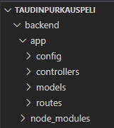
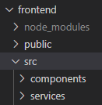

# Ohjelman alustava rakenne

Sisältää hyvin alustavan pohjan/kommentoinnin nykyisestä rakenteesta. Kehittyy projektin edetessä.

## Backend

Serverin toimintaan liittyvät asiat.

### Controllers
Määritellään routet ja niihin liittyvät tietokantojen taulukoiden toiminnallisuudet
Nimentä: camelCase (controllerin nimi sama kuin siihen viittaava service frontendissa)

### Models
Määritellään tietokantojen taulukot
Nimentä: modelin_nimi.model.js
modelin nimi on tietokantataulun nimi yksikössä ja pienillä kirjaimilla

### Requests
Sisältää VS codeen saatavan  -pluginin testitiedostot. Pluginin avulla on helppo testata tietokantaoperaatioiden toimintaa ilman frontendia

### Utils
sisältää sovelluksen konfiguraatioita (ympäristömuuttujien hakeminen tiedostosta ja tietokanta), loggerin ja itse määriteltyjä middlewareja

## Frontend

Ohjelman tiedot.

### Src/Components
Ohjelman alasivustojen määritykset

Nimentä: PascalCase.js, komponentissa määritelty nuolifunktio samanniminen kuin tiedosto ilman päätettä.

Muista importata react ja kääntämiseen vaadittu toiminnallisuus!

### Src/Services
Frontendin yhdistäminen backendiin

Nimentä: camelCase

### Sisältö: Monia nuolifunktioita, joista jokainen suorittaa jonkin sopivasti nimetyn toiminnallisuuden viemisen backendiin

Muista importtaa axios, joka huolehtii http-pyynnöistä!

Yksi service vastaa yhtä componentia, jolla on tarve keskustella backendin/tietokannan kanssa.

### Src/Tests
Frontendin yksikkötestit