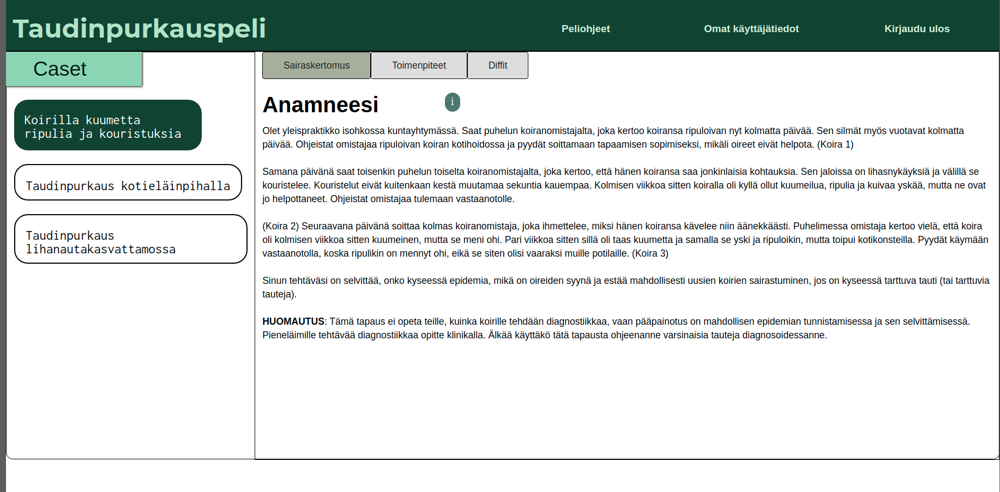
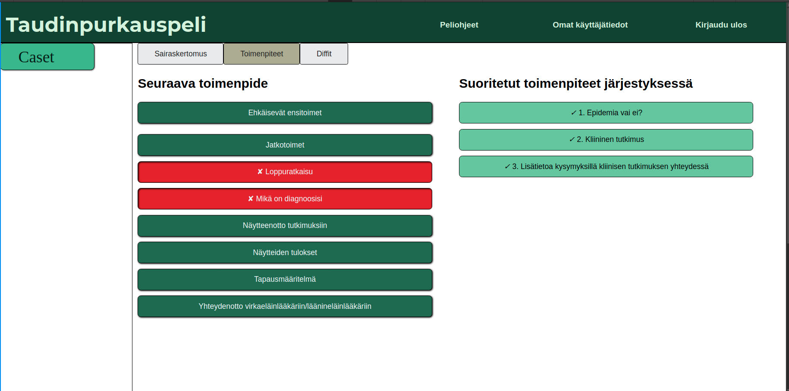
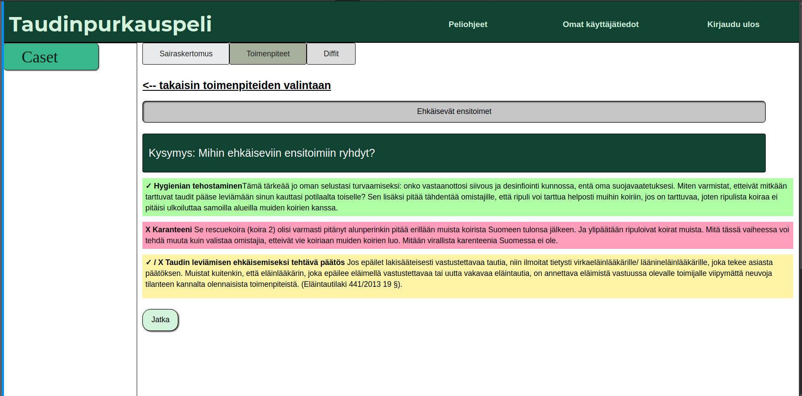
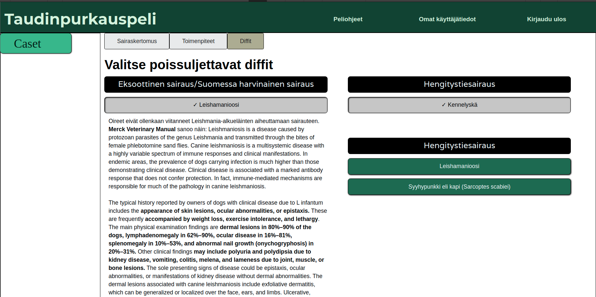
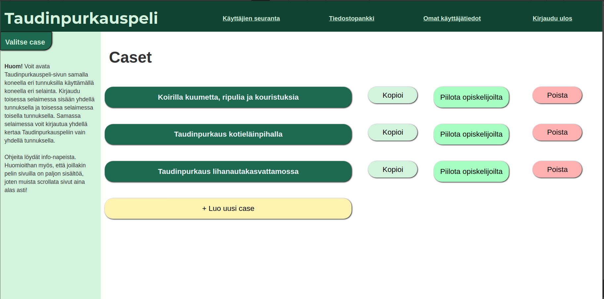
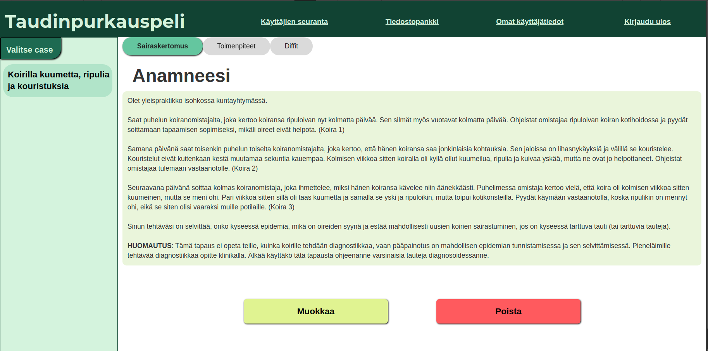
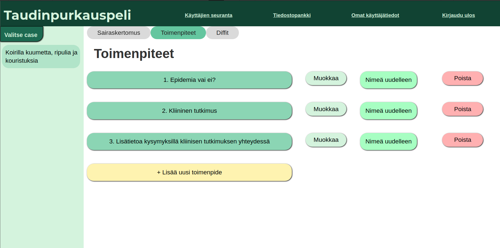
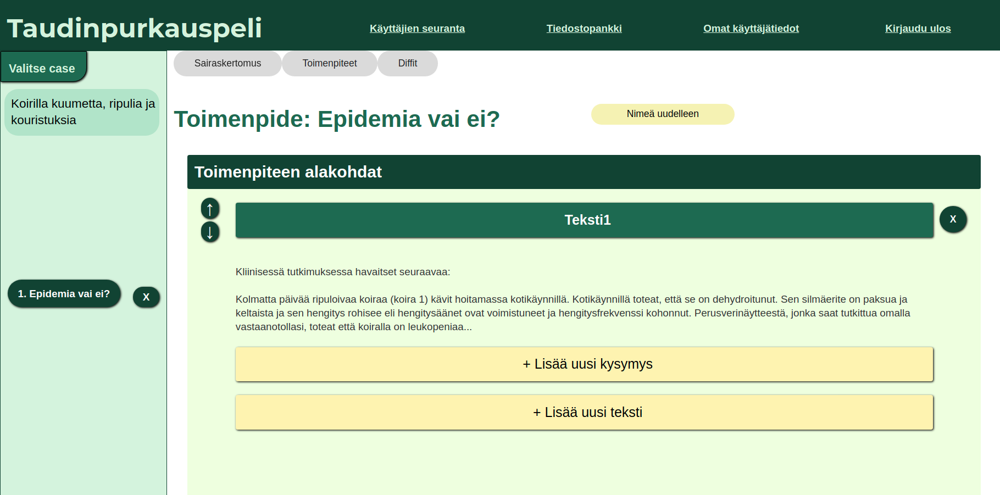
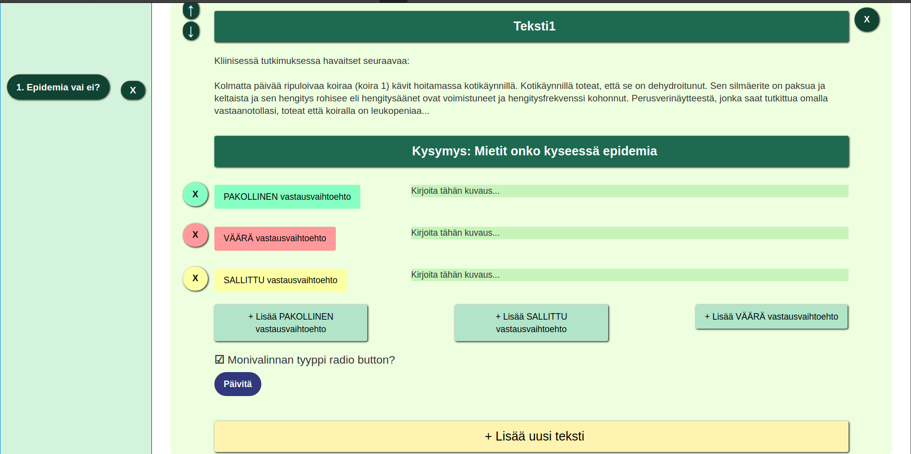
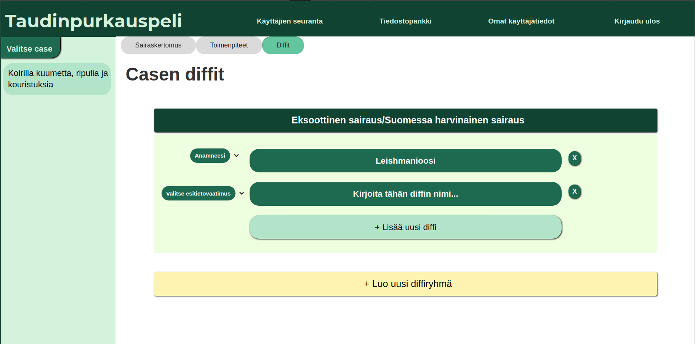

# Käyttöliittymäsuunnitelmia

## Käyttöliittymän kehityksestä yleisesti

Käyttöliittymää kehitetään asteittain, jotta päädytään mahdollisimman toimivaan lopputulokseen. Kehitykseen vaikuttavat mm. saavutettavuus-periaatteet, tekniset asiat ja tarkoituksenmukaisuus. Lisäksi käyttöliittymän tulee olla helppokäyttöinen ja intuitiivinen sekä ulkonäöltään viimeistelty.

Tämä sivu kehittyy sitä mukaan, kun käyttöliittymä kehittyy.

## Käyttöliittymän 1. versio
Käyttöliittymän ensimmäisessä versiossa on luonnosteltu pelin sivua ylipäänsä. Versiossa on toistaiseksi vain opiskelijan näkymä, jossa pääpainona on sivun funktionaalisuus ja saavutettavuus.

### Yleisiä huomioita/pohdittavia seikkoja
- Info-painikkeita lisätään sitä mukaan kuin tarpeellisia, tarkoituksena kuitenkin vähentää määrää
- Uusi peliohjeet-sivu
- Caset näkyvissä vai ei?
- Ulkonäkö: värivalinnat? Asettelu?
- Onko saavutettavuus otettu tarpeeksi huomioon symboleilla/väreillä?
- Erillinen etusivu vai esim. peliohjeet etusivuna?
- Oman prosessin edistyminen näkyvissä prosentteina?
- Diffien poissulkeminen vinkki?

### Opiskelija-käyttäjä

#### Sairaskertomus-sivu

#### Toimenpide-sivu

#### Toimenpide-sivu: kyselytoimenpide

#### Diffit-sivu

### Opettaja-käyttäjä

#### Etusivu / case-sivu

#### Sairaskertomus-sivu

#### Toimenpiteet-sivu

#### Toimenpiteen muokkaussivu

#### Toimenpiteen muokkaus / kysymyksen lisääminen

#### Diffit-sivu
